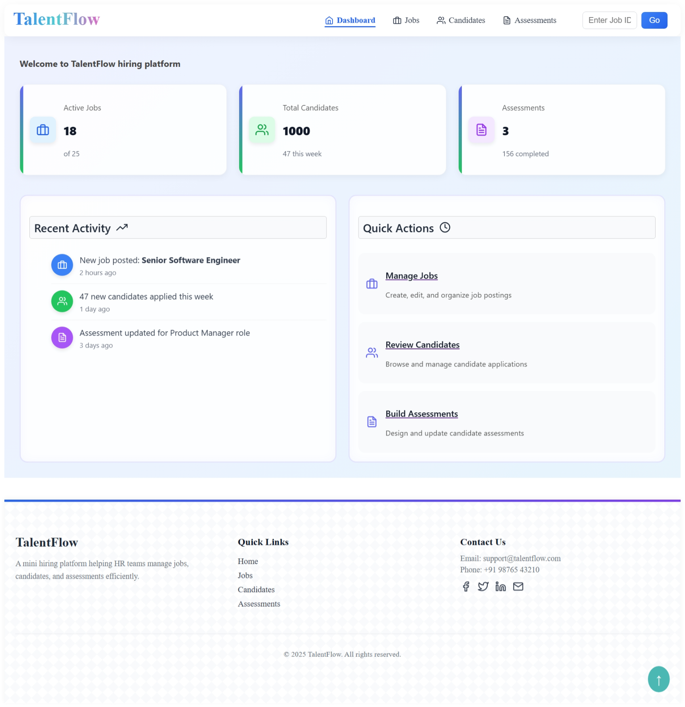
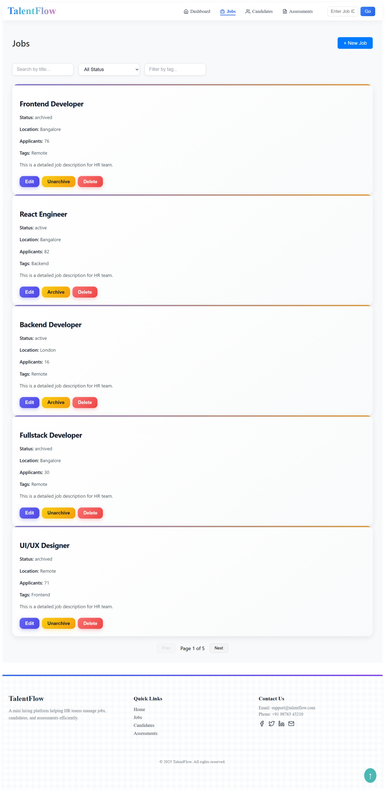
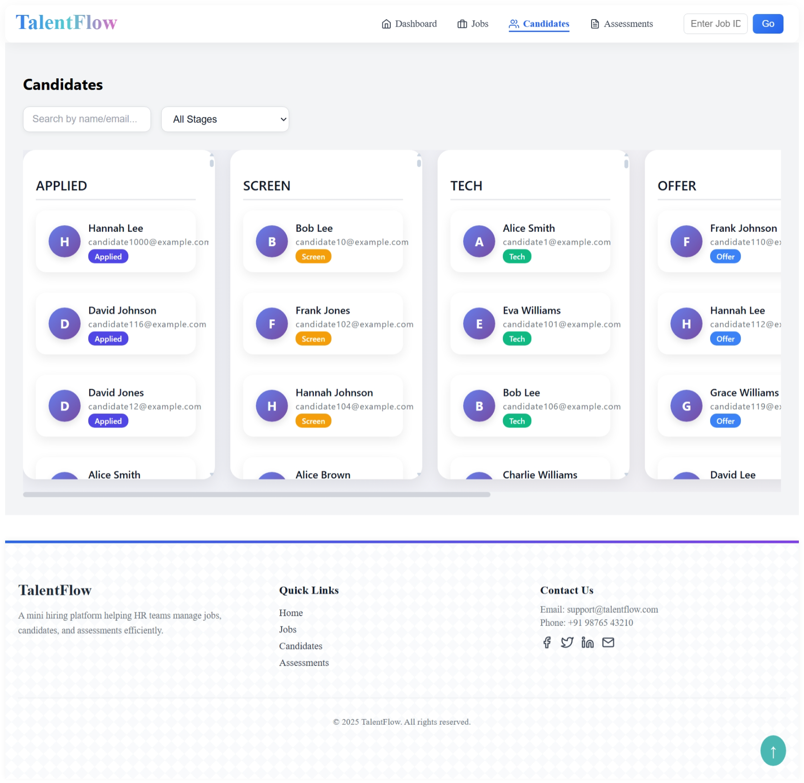
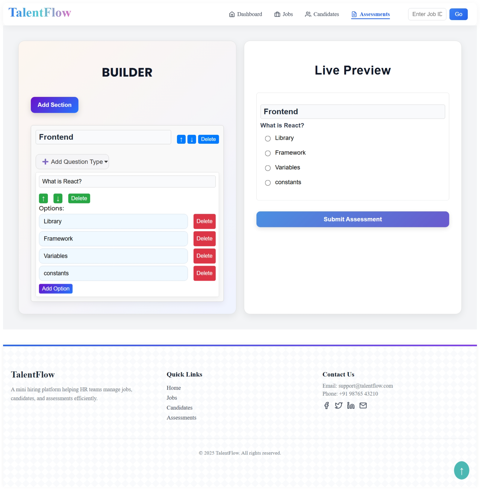

# Mini Hiring Platform

A modern, lightweight web application that simulates the functionality of a **hiring management system**.  
This project demonstrates how recruiters and hiring managers can:

- Post and manage job openings
- Manage candidate profiles
- Conduct and track assessments

It’s designed as a **mini project** to showcase full-stack thinking (frontend focus and mock server using mirag.js) with a clean UI, modular code structure, and easily extendable features.

---

## Screenshots

Screenshots help visualize the project quickly.

- **Dashboard**  
  

- **Jobs Page**  
  

- **Candidate Profile**  
  

- **Assessments Page**  
  

---

## Tech Stack

- **Frontend:** React, React Router, Hooks (useState, useEffect)
- **Backend (Mock):** Mirage.js (mock API server)
- **Styling:** CSS
- **Other Tools:** ESLint, Prettier, npm/yarn

## Motivation

The hiring process involves managing many moving parts: jobs, candidates, and assessments. Large-scale Applicant Tracking Systems (ATS) can be overwhelming for beginners.

This **Mini Hiring Platform** is a simplified version of an ATS that demonstrates:

- **React best practices** (component structure, hooks,useState, state management)
- **Clean project architecture** (pages, components, services separation)
- **Interactive UI** (drag-and-drop jobs, archive/unarchive, candidate profiles)

This project is ideal for:

- Students building portfolio projects
- Developers practicing React/JavaScript
- Recruiters reviewing coding style

---

## Features

**Jobs Management**

- Create new job postings
- Edit and update job details
- Reorder jobs with drag-and-drop
- Archive and unarchive job postings
- Delete jobs permanently

  **Candidates Management**

- Add and update candidate details (name, role, notes, etc.)
- View candidate profiles in detail
- Attach notes and toggle their visibility

**Assessments**

- Manage candidate assessments
- Track performance in real-time

**UI/UX Features**

- Responsive and clean design
- Pagination controls for job/candidate lists
- Loading states for better UX

---

## Project Structure

The project follows a **modular folder structure** for scalability:

```bash
mini-hiring-platform/
├── public/
│   └── index.html
├── src/
│   ├── components/        # Reusable UI components
│   │   ├── assessments/
│   │   ├   ├── AssessmentsBuilder.jsx
│   │   │   ├── PreviewPane.jsx
│   │   │   ├── AssessmentPageId.jsx
│   │   ├── candidates/
│   │   │   ├── CandidatesCard.jsx
│   │   │   ├── CandidatesProfile.jsx
│   │   │   ├── CandidatesKanban.jsx
│   │   │
│   │   ├── jobs/
│   │       ├── JobCard.jsx
│   │       ├── JobForm.jsx
│   │       ├── JobBoard.jsx
│   ├── pages/
│   │   ├── Footer.jsx
│   │   ├──Navbar.jsx
│   │
│   │   ├──screen/
│   │      ├── JobsPage.jsx
│   │      ├── CandidatesPage.jsx
│   │      └── AssessmentsPage.jsx
│   │      └── Home.jsx
│   │
│   ├── services/          # API/data handling layer
│   │   ├── jobs.js
│   │   ├── candidates.js
│   │   └── assessments.js
│   │
│   ├── mirage/
│   │   └── server.jsx
│   │
│   ├── App.js
│   └── index.js
│
├── screenshots/           # Project screenshots
│   ├── dashboard.png
│   ├── jobs.png
│   └── candidate-profile.png
│
├── main.jsx
├── package.json
└── README.md
```

## Live Demo

[Mini Hiring Platform Live](https://your-deployment-link.com)

## Usage

1. Open `http://localhost:3000` in your browser.
2. Navigate through the following pages:
   - **Dashboard** → Overview of jobs & candidates.
   - **Jobs Page** → Create, edit, reorder, archive jobs.
   - **Candidates Page** → View profiles, add notes.
   - **Assessments Page** → Manage and track assessments.
3. Try drag-and-drop on the Jobs Board to reorder postings.

## Roadmap / Future Enhancements

- ✅ Add drag-and-drop jobs board
- ✅ Candidate profile with notes
- 🔲 Authentication & login system
- 🔲 Real backend integration (Express.js / Node.js)
- 🔲 Advanced search & filtering for jobs/candidates
- 🔲 Analytics dashboard

## Installation & Setup

Follow these steps to run the project locally:

### 1. Clone the repository

```bash
git https://github.com/Pritee668/mini-hiring-project
```

### Navigate into the project folder

cd mini-hiring-project

## Install dependencies

### Make sure you have Node.js (>=16.x) and npm or yarn installed.

npm install

## Start the development server

npm start
